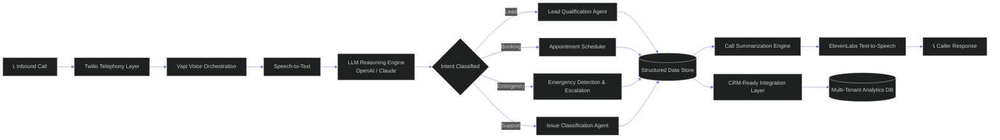
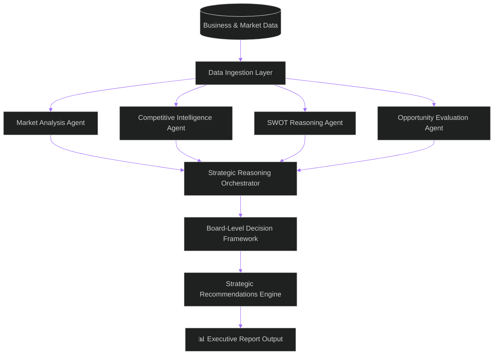
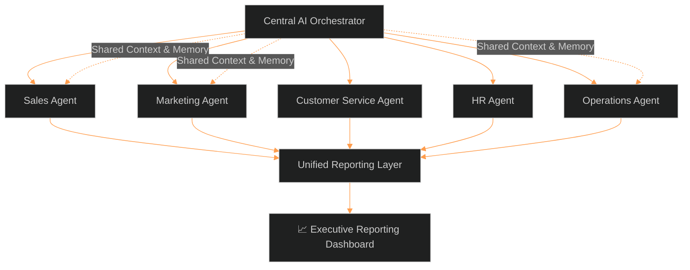
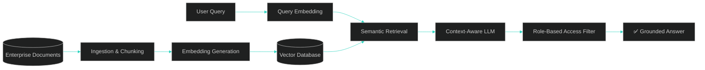
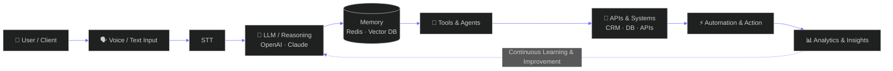

 

  

📍 Bangalore, India &nbsp;·&nbsp; 📞 +91 8618957790 &nbsp;·&nbsp; ✉️ md.sohail.8618@gmail.com

 

| 🧠 4+ | ⚙️ 15+ | 🔗 20+ | 📡 100K+ | ♾️ |
|:---:|:---:|:---:|:---:|:---:|
| **Years Experience** | **AI Projects Delivered** | **Systems Deployed** | **Calls Automated** | **Learning · Building · Scaling** |

## `｜` What I Build

<table width="100%">
<tr>
<td width="16.6%" align="center" valign="top">

**🧬 Generative AI**
LLM applications, RAG systems, prompt engineering, fine-tuning

</td>
<td width="16.6%" align="center" valign="top">

**🤖 AI Agents**
Intelligent agents, multi-agent systems, agentic workflows

</td>
<td width="16.6%" align="center" valign="top">

**🎙️ Voice AI**
AI voice agents, receptionists, STT/TTS, real-time conversations

</td>
<td width="16.6%" align="center" valign="top">

**📚 RAG & Knowledge**
Vector search, semantic retrieval, enterprise knowledge systems

</td>
<td width="16.6%" align="center" valign="top">

**⚙️ AI Automation**
Workflow automation, business process orchestration

</td>
<td width="16.6%" align="center" valign="top">

**🏢 Enterprise AI**
Scalable solutions, integrations, cloud-native architectures

</td>
</tr>
</table>

## `｜` Featured Projects

 

### 🏳️ `FLAGSHIP` — Call IQ
**Multi-Tenant AI Voice Agent Platform**

✅ AI Receptionists & Call Handling &nbsp;·&nbsp; ✅ Lead Qualification & Booking &nbsp;·&nbsp; ✅ Structured Call Analytics
✅ Multi-Tenant Architecture &nbsp;·&nbsp; ✅ Twilio · Vapi · ElevenLabs · OpenAI

[`📁 Repository`](#) &nbsp;·&nbsp; [`▶ Live Demo`](#)

 

### AI Strategic Intelligence System
**AI Board of Directors — Strategic Decision Support**

✅ SWOT & Market Analysis &nbsp;·&nbsp; ✅ Opportunity Evaluation &nbsp;·&nbsp; ✅ Competitive Intelligence
✅ Strategic Recommendations &nbsp;·&nbsp; ✅ Multi-Agent Reasoning

[`📁 Repository`](#)

 

### Business Operations AI Platform
**Multi-Agent Business Operations OS**

✅ Sales, Marketing, HR, Ops Agents &nbsp;·&nbsp; ✅ Workflow Automation &nbsp;·&nbsp; ✅ Executive Reporting
✅ Cross-Department AI Orchestration &nbsp;·&nbsp; ✅ Business Process Intelligence

[`📁 Repository`](#)

 

### RAG-Based Enterprise Search
**Intelligent Knowledge Retrieval System**

✅ Document Ingestion Pipeline &nbsp;·&nbsp; ✅ Vector Search & Semantic Retrieval &nbsp;·&nbsp; ✅ Contextual Q&A
✅ Role-Based Access &nbsp;·&nbsp; ✅ Enterprise Ready

[`📁 Repository`](#)

## `｜` Tech Stack

<table width="100%">
<tr>
<td valign="top" width="16.6%">

**🧠 LLMs & AI**

OpenAI Claude Azure OpenAI LangChain LangGraph

</td>
<td valign="top" width="16.6%">

**🎙️ Voice AI**

Vapi Twilio ElevenLabs Speech-to-Text Text-to-Speech

</td>
<td valign="top" width="16.6%">

**⌨️ Backend**

Python FastAPI Flask REST APIs Webhooks

</td>
<td valign="top" width="16.6%">

**🗄️ Databases**

PostgreSQL MongoDB Redis Vector DBs MySQL

</td>
<td valign="top" width="16.6%">

**☁️ Cloud & DevOps**

AWS Azure Docker Kubernetes GitHub Actions

</td>
<td valign="top" width="16.6%">

**🛠️ Tools**

Linux Git GitHub CI/CD Postman

</td>
</tr>
</table>

## `｜` System Architecture & Design

## `｜` GitHub Analytics

  

## `｜` Let's Connect

I'm always open to discussing AI architecture, voice AI systems, and impactful opportunities.

  

> *"The future belongs to those who build intelligent systems that empower humans."*
> — Mohammed Sohail

 

