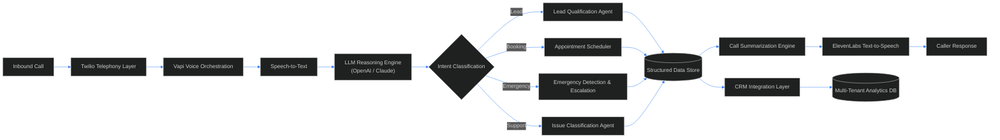
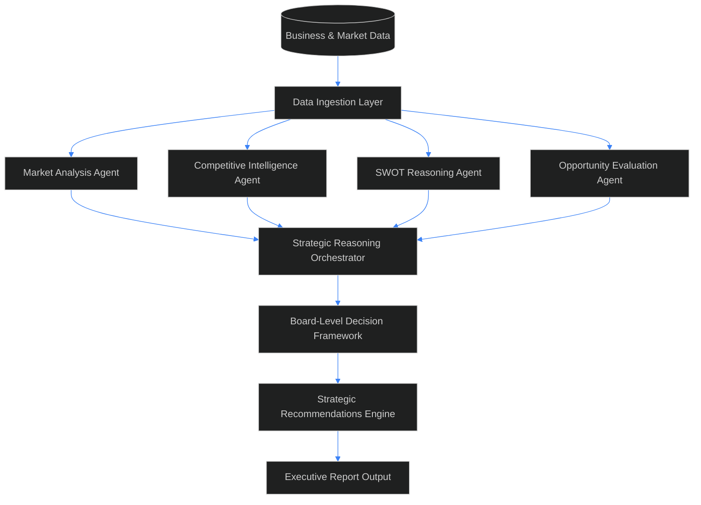
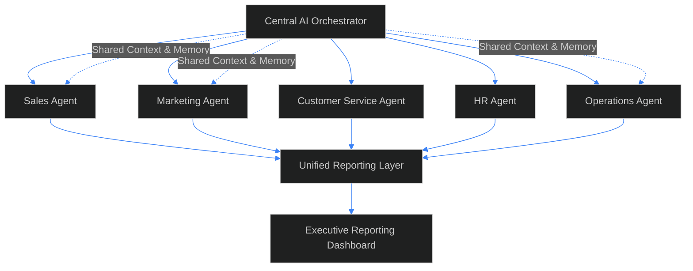
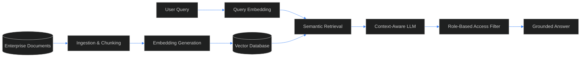
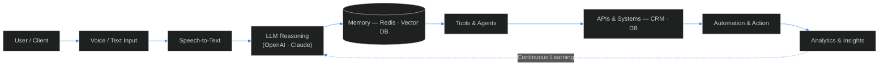

  

 

 

<table width="100%">
<tr>
<td align="center" width="20%"><h3>4+</h3>Years of Experience</td>
<td align="center" width="20%"><h3>15+</h3>AI Systems Delivered</td>
<td align="center" width="20%"><h3>20+</h3>Production Deployments</td>
<td align="center" width="20%"><h3>100K+</h3>Calls Automated</td>
<td align="center" width="20%"><h3>UAE · US</h3>Client Markets</td>
</tr>
</table>

 

## Profile

**AI Solutions Architect & AI Engineer** with 4+ years of experience designing and shipping Generative AI systems for enterprise and independent clients across the UAE and US markets — spanning Voice AI platforms, multi-agent orchestration, RAG pipelines, and enterprise automation.

Currently architecting **Call IQ**, a multi-tenant AI Voice Agent platform, alongside board-level strategic intelligence systems and cross-functional AI operations frameworks. Focused on translating frontier LLM capability into dependable, production-grade infrastructure.

 

## Core Expertise

<table width="100%">
<tr>
<td width="25%" valign="top">

**Generative AI**
LLM application design, RAG architecture, prompt engineering, model fine-tuning

</td>
<td width="25%" valign="top">

**Multi-Agent Systems**
Agentic workflows, tool-calling orchestration, shared-memory agent hierarchies

</td>
<td width="25%" valign="top">

**Voice AI**
Real-time conversational pipelines, telephony integration, structured call analytics

</td>
<td width="25%" valign="top">

**Enterprise Automation**
Workflow orchestration, CRM integration, cloud-native AI infrastructure

</td>
</tr>
</table>

 

## Featured Systems

 

<table width="100%">
<tr><td>

### Call IQ — Multi-Tenant AI Voice Agent Platform
`FLAGSHIP`

Production voice AI system handling lead qualification, appointment booking, structured call summarization, and emergency detection across HVAC, real estate, and field-service verticals.

`OpenAI` `Claude` `Vapi` `Twilio` `ElevenLabs` `Python` `FastAPI`

[Repository →](#) &nbsp;&nbsp;|&nbsp;&nbsp; [Live Demo →](#)

</td></tr>
</table>

 

<table width="100%">
<tr><td>

### AI Strategic Intelligence System
Board-level AI decision support producing SWOT analysis, market opportunity evaluation, competitive intelligence, and structured strategic recommendations.

`OpenAI` `Claude` `Multi-Agent Workflows`

[Repository →](#)

</td></tr>
</table>

 

<table width="100%">
<tr><td>

### Business Operations AI Platform
Multi-agent business operations system coordinating Sales, Marketing, Customer Service, HR, and Operations with unified executive reporting.

`OpenAI` `Multi-Agent Systems` `Workflow Automation`

[Repository →](#)

</td></tr>
</table>

 

<table width="100%">
<tr><td>

### RAG-Based Enterprise Search
Semantic search and retrieval-augmented generation system for enterprise knowledge bases, with role-based access and grounded contextual Q&A.

`RAG` `Vector Search` `Azure AI`

[Repository →](#)

</td></tr>
</table>

 

## Technology Stack

<table width="100%">
<tr>
<td valign="top" width="16.6%"><strong>LLMs & AI</strong> OpenAI Claude Azure OpenAI LangChain LangGraph</td>
<td valign="top" width="16.6%"><strong>Voice AI</strong> Vapi Twilio ElevenLabs Speech-to-Text Text-to-Speech</td>
<td valign="top" width="16.6%"><strong>Backend</strong> Python FastAPI Flask REST APIs Webhooks</td>
<td valign="top" width="16.6%"><strong>Databases</strong> PostgreSQL MongoDB Redis Vector DBs MySQL</td>
<td valign="top" width="16.6%"><strong>Cloud & DevOps</strong> AWS Azure Docker Kubernetes GitHub Actions</td>
<td valign="top" width="16.6%"><strong>Tools</strong> Linux Git GitHub CI/CD Postman</td>
</tr>
</table>

 

## System Architecture

 

## GitHub Analytics

  

 

## Contact

Open to contract engagements, technical advisory, and founding AI architect roles.

  

Bangalore, India · Remote-first · Available for UAE / US market engagements

