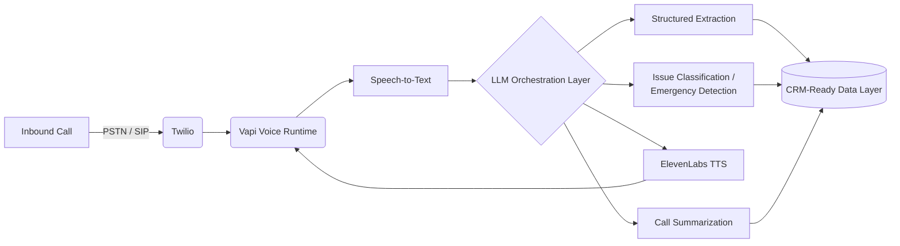
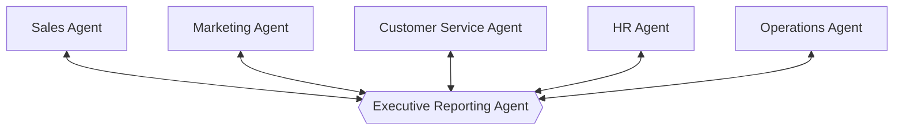

<div align="center">
  
</div>

<br/>

I design and ship systems that make decisions, not just scripts that run tasks — voice agents that qualify leads on live calls, multi-agent networks that run business operations, and retrieval systems that make LLMs answer from real company data instead of guessing.

Currently building **Call IQ** in production for a Dubai-based client, and taking on a small number of new independent consulting engagements.

<br/>

## `01` Architecture — Call IQ

Multi-tenant AI voice agent platform. Answers real calls, extracts structured data, routes emergencies, and writes CRM-ready summaries — for HVAC, plumbing, electrical, and real estate operators.



## `02` Architecture — Multi-Agent Business Operations

A board-of-agents model: five functional agents report structured findings up to an executive reporting layer, which returns priorities back down.



<br/>

## `03` Capability Matrix

```text
GENERATIVE AI / LLM ENGINEERING     ████████████████████  expert
MULTI-AGENT ORCHESTRATION           ███████████████████░  expert
VOICE AI  (vapi · twilio · 11labs)  ███████████████████░  expert
RAG / VECTOR RETRIEVAL              █████████████████░░░  advanced
BACKEND  (python · fastapi)         ██████████████████░░  advanced
CLOUD / DEVOPS  (aws · k8s · ci-cd) ███████████████░░░░░  proficient
```

<br/>

## `04` Service Log

```yaml
service:  ai-consultant-contract
status:   ACTIVE
client:   Dubai, UAE (remote)
uptime:   03/2026 — present
---
- Architected Call IQ, a multi-tenant AI voice agent platform: lead
  qualification, appointment booking, call analytics, automation
- Built conversational pipelines across OpenAI, Vapi, Twilio, ElevenLabs
- Designed CRM-ready integration architecture for service-industry
  and real-estate deployments
- Led the AI Strategic Intelligence System — a board-level decision
  framework for evaluating business opportunities
- Produced architecture docs, implementation roadmaps, deployment plans
```

```yaml
service:  generative-ai-applications-engineer
status:   ARCHIVED
client:   ISAN Data Systems Pvt. Ltd.
uptime:   09/2025 — 01/2026
---
- Built RAG + vector search systems for enterprise information retrieval
- Shipped AI-powered workflow automation for internal business processes
- Optimized prompt-engineering pipelines for response consistency
```

```yaml
service:  systems-application-environment-engineer
status:   ARCHIVED
client:   Rakuten India Enterprise Pvt. Ltd.
uptime:   08/2022 — 07/2025
---
- Automated system health monitoring and operational workflows in Python
- Owned root-cause analysis for production incidents
- Ran SQL-based reporting and data-extraction pipelines
```

<details>
<summary><code>05</code> Full deployment history (earlier roles)</summary>
<br/>

```yaml
service:  it-infrastructure-automation-intern
status:   ARCHIVED
client:   COSS — with Prodevans & Red Hat
uptime:   01/2022 — 07/2022
---
- Wrote Python automation scripts for Linux administration
- Trained on RHCSA/RHCE fundamentals; hands-on with Docker, AWS, K8s
```

</details>

<br/>

## `06` Stack

`Python` `FastAPI` `OpenAI` `Anthropic Claude` `Azure OpenAI` `Vapi` `Twilio` `ElevenLabs` `PostgreSQL` `MongoDB` `Redis` `Docker` `Kubernetes` `AWS` `Azure`

<br/>

<div align="center">
<sub>Bangalore, India · remote-first · <a href="mailto:md.sohail.8618@gmail.com">md.sohail.8618@gmail.com</a></sub>
</div>
