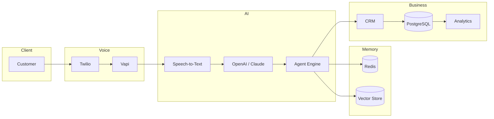
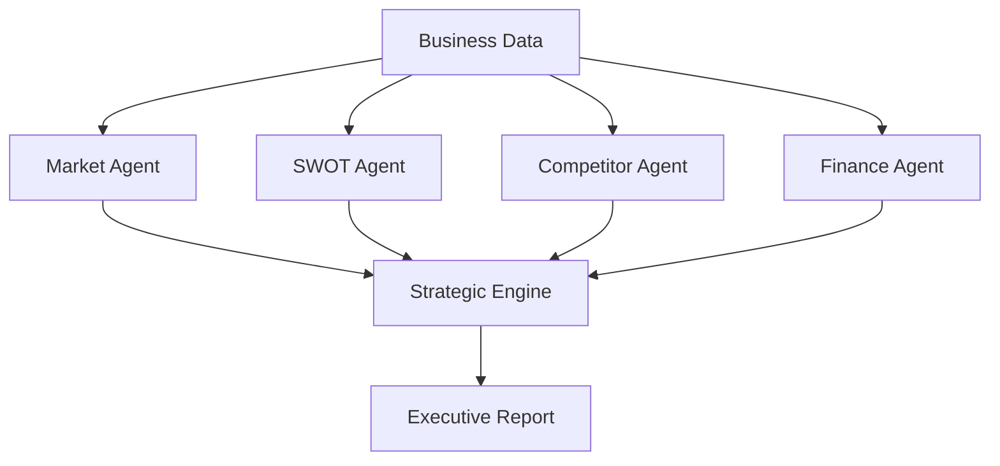
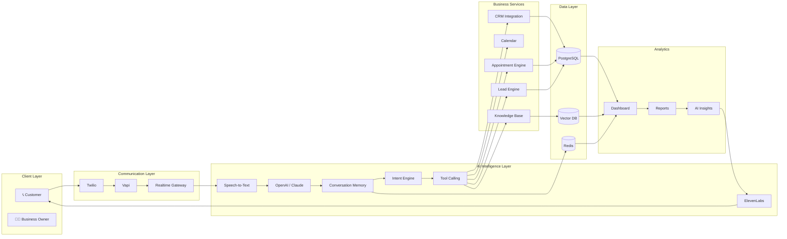
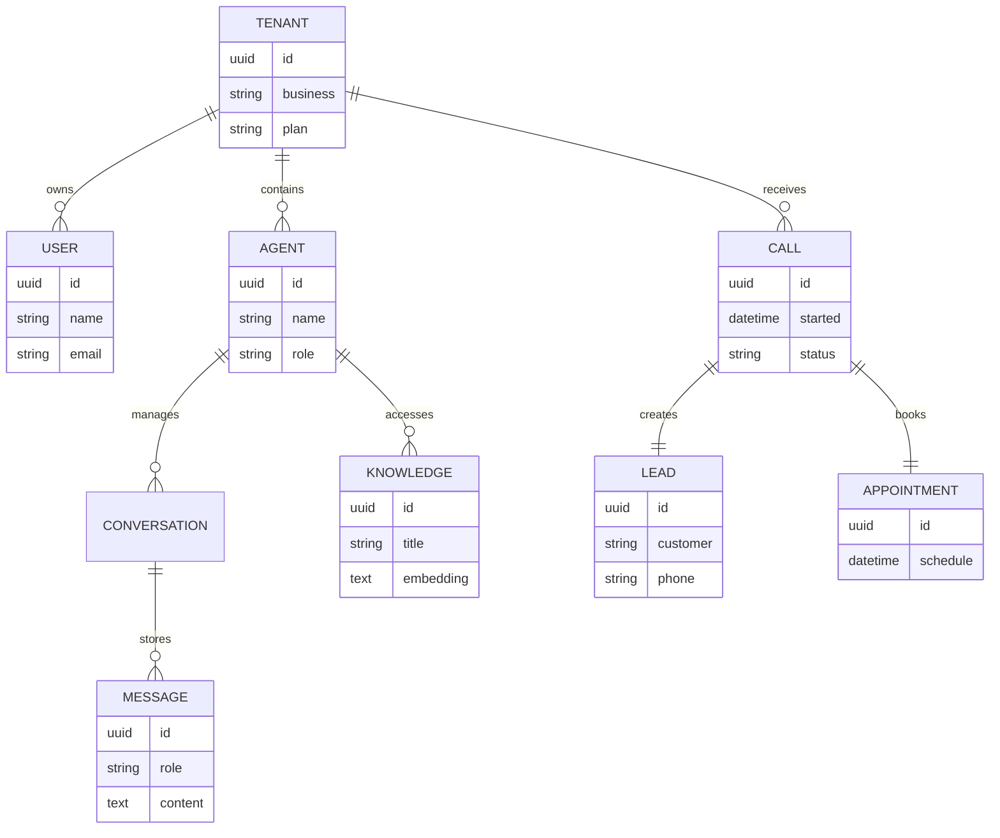
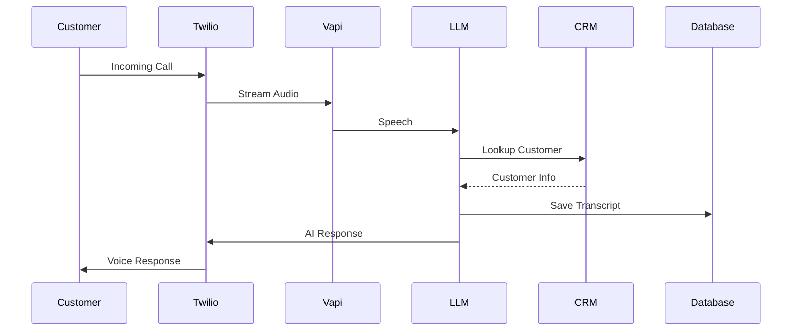
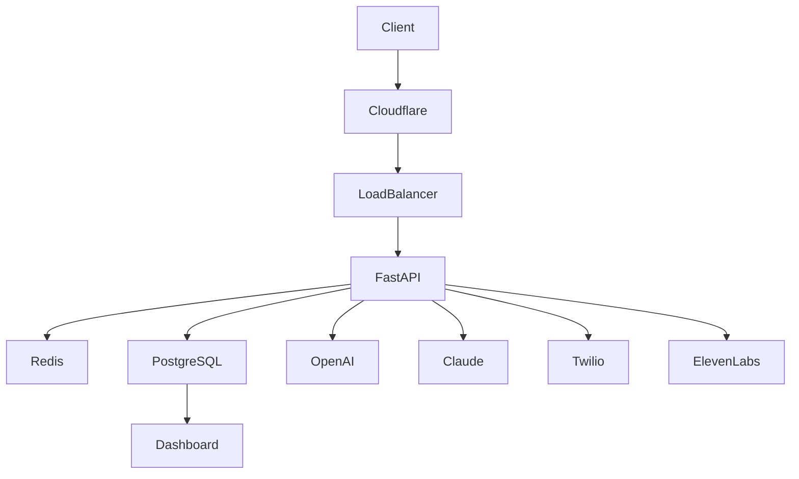
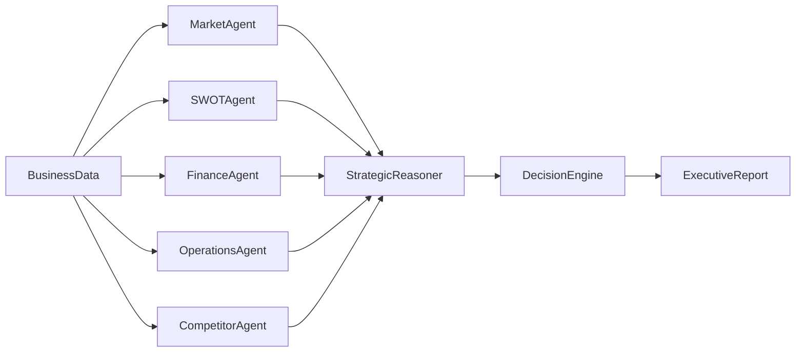
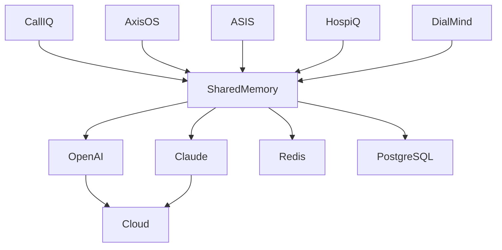

<div align="center">


<br/>

# Mohammed Sohail

### AI Solutions Architect • Generative AI Engineer • Voice AI Engineer • Enterprise AI Systems

<p align="center">

<a href="https://www.linkedin.com/in/mohammed-sohail-000254201">

</a>

<a href="https://github.com/mohammedsohail7790">

</a>

<a href="mailto:md.sohail.8618@gmail.com">

</a>

<a href="https://yourportfolio.vercel.app">

</a>

</p>


</div>

---

# Executive Overview

<table>
<tr>

<td width="20%" align="center">

## 🚀

### 4+

Years

Experience

</td>

<td width="20%" align="center">

## 🤖

### 8+

Enterprise

Platforms

</td>

<td width="20%" align="center">

## ⚡

### 25+

Core

Technologies

</td>

<td width="20%" align="center">

## 🏗️

### AI

Architecture

Focus

</td>

<td width="20%" align="center">

## 🌍

India • UAE • US

Remote

</td>

</tr>
</table>

---

# About Me

I'm an **AI Solutions Architect** focused on designing enterprise-grade AI platforms that combine Large Language Models, Voice AI, Multi-Agent Systems, Retrieval-Augmented Generation (RAG), and cloud-native infrastructure into scalable production systems.

My work focuses on architecting dependable AI applications—from intelligent voice agents and enterprise automation to strategic decision-support platforms—while emphasizing reliability, maintainability, security, and scalable system design.

---

# Current Focus

| Platform | Status | Description |
|-----------|--------|-------------|
| 🚀 Call IQ | Private | Enterprise Multi-Tenant Voice AI Platform |
| 🏢 AxisOS | Private | Enterprise AI Operating System |
| 📈 ASIS | Public | Strategic Intelligence Platform |
| 🏨 HospiQ | Private | Hospitality AI Platform |
| 🧠 DialMind | Private | Conversational AI Platform |
| 🌐 Portfolio | Public | Interactive Engineering Portfolio |

---

# Core Expertise

<table>

<tr>

<td width="25%">

## 🤖 AI Engineering

- OpenAI
- Claude
- LangChain
- LangGraph
- Prompt Engineering
- RAG
- AI Agents

</td>

<td width="25%">

## 🎙 Voice AI

- Twilio
- Vapi
- ElevenLabs
- Deepgram
- Azure Speech
- Realtime AI

</td>

<td width="25%">

## ⚙ Backend

- Python
- FastAPI
- Flask
- Node.js
- REST APIs
- WebSockets

</td>

<td width="25%">

## ☁ Cloud

- AWS
- Azure
- Docker
- Kubernetes
- GitHub Actions
- PostgreSQL
- Redis

</td>

</tr>

</table>

---


# 🚀 Featured Enterprise Platforms

> Building production-grade AI platforms focused on Voice AI, Multi-Agent Systems, Enterprise Automation, and Strategic Intelligence.

---

## 🚀 Call IQ

> **Flagship Private Enterprise Platform**

Enterprise-grade multi-tenant Voice AI platform for service businesses capable of answering calls, qualifying leads, booking appointments, transferring emergencies, and integrating with CRMs.

**Status**


### Tech Stack

```text
OpenAI
Claude
Twilio
Vapi
ElevenLabs
FastAPI
Python
Redis
PostgreSQL
Docker
Azure
AWS
```

### Key Features

- Multi-Tenant Architecture
- AI Voice Receptionist
- Appointment Booking
- Lead Qualification
- CRM Integration
- Emergency Detection
- Real-Time Analytics
- AI Call Summaries
- Human Transfer
- Voice Memory

<details>

<summary><b>🏗 Architecture</b></summary>



</details>

---

## 🧠 ASIS

> **Public Repository**

AI Strategic Intelligence System for executive decision support, SWOT analysis, market intelligence, competitive analysis, and board-level recommendations.

### Repository

https://github.com/mohammedsohail7790/ASIS

### Highlights

- Multi-Agent Reasoning
- SWOT Engine
- Strategic Analysis
- Business Intelligence
- Executive Reporting

<details>

<summary><b>Architecture</b></summary>



</details>

---

## 🌐 Portfolio

> **Public Repository**

Interactive developer portfolio showcasing enterprise AI projects, engineering philosophy, architecture, and technical capabilities.

### Repository

https://github.com/mohammedsohail7790/Portfolio

### Built With

- Next.js
- TypeScript
- TailwindCSS
- Framer Motion
- GSAP

---

# 🔒 Enterprise Platforms

The following enterprise platforms are actively developed but remain private repositories.

| Platform | Description |
|----------|-------------|
| 🚀 Call IQ Frontend | Enterprise SaaS Dashboard |
| 🏢 AxisOS | Enterprise AI Operating System |
| 🏨 HospiQ | Hospitality AI Platform |
| 🧠 DialMind | Conversational AI Platform |
| 🎨 Pixel Perfect Clone | Advanced Frontend Engineering |

---

# 🏗 Engineering Principles

✔ AI-first Architecture

✔ Domain-Driven Design

✔ Multi-Tenant Systems

✔ Event-Driven Communication

✔ Clean Architecture

✔ Enterprise Security

✔ Cloud Native

✔ CI/CD

✔ Infrastructure as Code

✔ Scalability

✔ Reliability

✔ Observability

# 🏗 Enterprise Architecture Gallery

---

# Call IQ — Enterprise Voice AI Platform



---

# Call IQ ER Diagram



---

# Call IQ Sequence Diagram



---

# Call IQ Deployment



---

# ASIS Architecture



---

# Enterprise AI Ecosystem



---


# ⚡ Technology Ecosystem

> Enterprise-grade technologies used to build scalable AI platforms, intelligent automation, and cloud-native systems.

---

## 🤖 AI & LLM Engineering

<p align="center">


</p>

| Area | Technologies |
|------|--------------|
| LLMs | OpenAI • Claude • Azure OpenAI |
| Frameworks | LangChain • LangGraph |
| AI Systems | RAG • AI Agents • Prompt Engineering |
| Search | Vector Search • Semantic Retrieval |
| Automation | Tool Calling • Workflow Orchestration |

---

## 🎙 Voice AI

| Platform | Usage |
|-----------|-------|
| Twilio | Telephony |
| Vapi | Voice Orchestration |
| ElevenLabs | Text-to-Speech |
| Deepgram | Speech Recognition |
| Azure Speech | Speech Services |

---

## ⚙ Backend Engineering

<p align="center">


</p>

- FastAPI
- Python
- Node.js
- REST APIs
- WebSockets
- Authentication
- Webhooks
- Background Workers

---

## 🌐 Frontend Engineering

<p align="center">


</p>

- React
- Next.js
- TypeScript
- TailwindCSS
- Framer Motion
- Responsive UI

---

## 🗄 Data & Storage

<p align="center">


</p>

- PostgreSQL
- MongoDB
- Redis
- MySQL
- Vector Databases

---

## ☁ Cloud & DevOps

<p align="center">


</p>

- AWS
- Azure
- Docker
- Kubernetes
- CI/CD
- GitHub Actions

---

# 🧠 AI Capability Matrix

| Capability | Experience |
|------------|------------|
| Voice AI | ████████████ |
| LLM Applications | ████████████ |
| AI Agents | ████████████ |
| Multi-Agent Systems | ███████████ |
| Enterprise Automation | ███████████ |
| RAG Systems | ███████████ |
| Cloud Architecture | ██████████ |
| Backend Engineering | ████████████ |

---

# 🚀 Current Engineering Focus

```text
✔ Enterprise Voice AI

✔ Multi-Agent Systems

✔ AI Operating Systems

✔ Strategic Intelligence

✔ Enterprise Automation

✔ LLM Infrastructure

✔ Cloud Native Architecture

✔ AI Workflow Orchestration

✔ Knowledge Systems

✔ Production AI
```

---

# 📈 Engineering Journey

```text
2022

AWS • DevOps
      │
      ▼
Backend Engineering
      │
      ▼
Generative AI
      │
      ▼
Voice AI
      │
      ▼
Multi-Agent Systems
      │
      ▼
Enterprise AI Platforms
      │
      ▼
AI Solutions Architect
```

---

# 🏆 Engineering Principles

✔ Clean Architecture

✔ Domain Driven Design

✔ API First

✔ Event Driven Systems

✔ Enterprise Security

✔ Cloud Native

✔ Scalability

✔ Reliability

✔ Observability

✔ AI Governance

✔ Production Readiness

✔ Documentation First

---

# 🌍 Domains

| Industry | Solutions |
|----------|-----------|
| HVAC | Voice AI |
| Hospitality | AI Automation |
| Real Estate | AI Assistants |
| Enterprise | Strategic Intelligence |
| SaaS | Multi-Tenant Platforms |
| Customer Support | AI Agents |

---
# 📊 Engineering Metrics

<div align="center">


<br><br>


</div>

---

# 📈 Contribution Activity

<p align="center">


</p>

---

# 🏆 GitHub Achievements

<p align="center">


</p>

---

# 🐍 Contribution Snake

<p align="center">


</p>

---

# 📚 Certifications

| Provider | Certifications |
|-----------|----------------|
| Microsoft | Azure Fundamentals |
| Google Cloud | Generative AI |
| IBM | Cybersecurity |
| Cisco | Networking & Security |
| AWS | Cloud & DevOps |

---

# 🚀 Currently Exploring

- AI Operating Systems
- Agentic AI
- Enterprise AI Governance
- Voice AI Infrastructure
- Model Context Protocol (MCP)
- AI Workflow Automation
- Multi-Agent Memory
- Enterprise Knowledge Graphs

---

# 🤝 Open For

<table>

<tr>

<td align="center">

🏢

Enterprise AI

Architecture

</td>

<td align="center">

🤖

Generative AI

Consulting

</td>

<td align="center">

🎙

Voice AI

Platforms

</td>

<td align="center">

⚙️

AI Automation

</td>

<td align="center">

🚀

Founding AI

Engineer

</td>

</tr>

</table>

---

# 🌍 Connect With Me

<p align="center">

<a href="https://www.linkedin.com/in/mohammed-sohail-000254201">


</a>

<a href="mailto:md.sohail.8618@gmail.com">


</a>

<a href="https://github.com/mohammedsohail7790">


</a>

</p>

---

<div align="center">

### 💡 "Building AI systems that are scalable, reliable, and production-ready."


</div>

